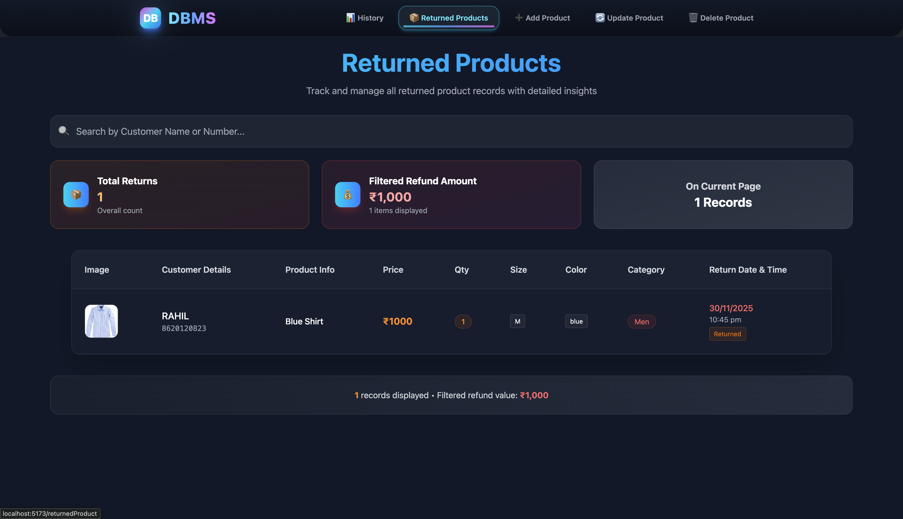

# DataBase Management System

<p align="center">
  
</p>

⚠️ Notes:

This is not created for hosting online.It is just an Interface used to interact with the MongoDB,helps manage your inventory.


## 🔧 Setup Guide

Follow the steps below to run the project.

---

## 📁 Environment Variables Setup

Create a `.env` file in **backend** directory.

---

## 🔧 Backend `.env`

```env
DB_CONNECT_STRING=xxx
```
Where to get them:

MongoDB Atlas → https://www.mongodb.com/products/platform/atlas-database


# 📦 Install Dependencies

Run this command inside both frontend and backend folders:
```
npm install
```

# ▶️ Run the Project

Start both servers simultaneously using command:
```
npm run dev
```
